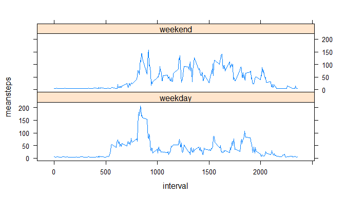

# Reproducible Research: Peer Assessment 1


## Loading and preprocessing the data
Once the file is in your working directory, read the data into R:

```r
dat <- read.csv("activity.csv")
```


## What is mean total number of steps taken per day?
The sum is applied over each day using tapply, and the mean is taken after:

```r
dailytot <- data.frame(unique(dat$date),tapply(dat$steps, dat$date, sum, na.rm = TRUE), row.names=NULL)
names(dailytot) <- c("date","totalsteps")
mean(dailytot$totalsteps)
```

```
## [1] 9354.23
```
Here is the histogram created by the data:

```r
hist(dailytot$totalsteps, breaks = 20, xlab = "Steps Per Day", main = "Frequency of Daily Step Totals")
```

 

## What is the average daily activity pattern?
The mean was applied of the original data set for each interval. The max interval is identified.

```r
intervaltot <- data.frame(unique(dat$interval), tapply(dat$steps, dat$interval, mean, na.rm = TRUE), row.names=NULL)
names(intervaltot) <- c("interval","meansteps")
max <- intervaltot[which.max(intervaltot$meansteps),]
max
```

```
##     interval meansteps
## 104      835  206.1698
```
The plot of the interval averages is below:

```r
plot(intervaltot$interval, intervaltot$meansteps, type = "l", ylab = "Avg. # of Steps", xlab = "Time Interval in Minutes", main = "Average Steps Per Time Interval (All Days)")
```

 

## Imputing missing values
The missing values were replaced by the global average per interval.

```r
datnona <- dat
datnona[is.na(datnona)] <- mean(dailytot$totalsteps, na.rm = TRUE)/length(intervaltot$interval)
dailytotnona <- data.frame(unique(datnona$date),tapply(datnona$steps, datnona$date, sum, na.rm = TRUE), row.names=NULL)
names(dailytotnona) <- c("date","totalsteps")
```
The medians are unaffected but the means have changed:
Original Set:

```r
mean(dailytot$totalsteps)
```

```
## [1] 9354.23
```

```r
median(dailytot$totalsteps)
```

```
## [1] 10395
```
NA's Removed:

```r
mean(dailytotnona$totalsteps)
```

```
## [1] 10581.01
```

```r
median(dailytotnona$totalsteps)
```

```
## [1] 10395
```

## Are there differences in activity patterns between weekdays and weekends?
The data were split into two sets by weekday and weekend:

```r
datdates <- datnona
datdates$date <- as.Date(datdates$date)
datdates$weekdays <- weekdays(datdates$date)
datdates$weekdays <- gsub(c("Saturday"), "weekend",datdates$weekdays)
datdates$weekdays <- gsub(c("Sunday"), "weekend",datdates$weekdays)
datdates$weekdays[which(datdates$weekdays != "weekend")] <- "weekday"
datdates$weekdays <- as.factor(datdates$weekdays)
datweekdays <- datdates[which(datdates$weekdays == "weekday"),]
datweekends <- datdates[which(datdates$weekdays == "weekend"),]
```
And then the mean was applied over each set by interval before the sets were rejoined:

```r
intervalweekday <- data.frame(unique(datweekdays$interval), tapply(datweekdays$steps, datweekdays$interval, mean, na.rm = TRUE), row.names=NULL)
names(intervalweekday) <- c("interval","meansteps")
intervalweekend <- data.frame(unique(datweekends$interval), tapply(datweekends$steps, datweekends$interval, mean, na.rm = TRUE), row.names=NULL)
names(intervalweekend) <- c("interval","meansteps")
intervalweekday$weekday <- "weekday"
intervalweekend$weekday <- "weekend"
intervalall <- rbind(intervalweekday,intervalweekend)
```
The following plot shows the difference in activity:

```r
library(lattice)
xyplot(meansteps~interval|weekday, data = intervalall, type = "l", layout = c(1,2))
```

 

